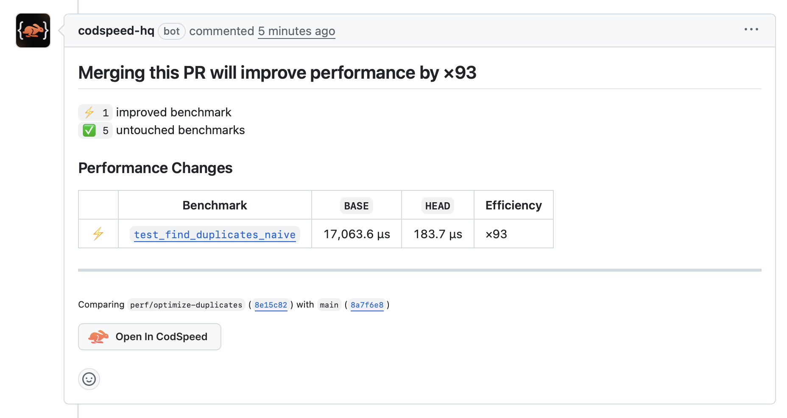

# CodSpeed Demo

A demo project for learning [CodSpeed](https://codspeed.io) — continuous performance testing for your CI.

## What is CodSpeed?

CodSpeed catches performance regressions in pull requests before they hit production. It uses CPU simulation (via Valgrind) instead of wall-clock timing, which gives **<1% variance** compared to the 10-30% variance typical of timing-based benchmarks in CI.

Key features:
- **Differential flamegraphs** — see exactly which functions got slower
- **PR comments & status checks** — performance impact surfaced directly in your workflow
- **Merge protection** — block PRs that exceed regression thresholds
- **Free for open source**

## Project Structure

```
codspeed-demo/
├── .github/workflows/benchmarks.yml   # CodSpeed CI workflow
├── codspeed_demo/
│   ├── __init__.py
│   └── algorithms.py                   # Algorithms to benchmark
├── tests/
│   ├── __init__.py
│   └── test_benchmarks.py             # Benchmark tests
└── pyproject.toml
```

## Algorithms

The demo includes algorithms with intentionally different complexities to demonstrate performance comparisons:

| Algorithm | Time Complexity | Purpose |
|-----------|----------------|---------|
| `fibonacci_recursive` | O(2^n) | Slow baseline |
| `fibonacci_iterative` | O(n) | Fast alternative |
| `bubble_sort` | O(n²) | Sorting benchmark |
| `find_duplicates_naive` | O(n²) | Slow baseline |
| `find_duplicates_set` | O(n) | Fast alternative |

## Setup

### Prerequisites

- Python 3.14+
- [uv](https://docs.astral.sh/uv/) package manager

### Install dependencies

```bash
uv sync --dev
```

### Run tests locally

```bash
uv run pytest tests/test_benchmarks.py -v
```

Note: CodSpeed instrumentation is disabled locally. You'll see:
```
codspeed: 4.2.0 (disabled, mode: walltime, ...)
```

This is expected — actual benchmarking happens in CI.

## CodSpeed Setup

### 1. Create GitHub repo

```bash
git init
git add .
git commit -m "feat: initial codspeed demo setup"
gh repo create codspeed-demo --public --source=. --push
```

### 2. Connect to CodSpeed

1. Go to [codspeed.io](https://codspeed.io)
2. Sign in with GitHub
3. Select your repository
4. Copy the `CODSPEED_TOKEN`

### 3. Add secret to GitHub

```bash
gh secret set CODSPEED_TOKEN
# Paste your token when prompted
```

Or via GitHub UI: Settings → Secrets → Actions → New repository secret

### 4. Push to main

The first push to `main` establishes the baseline:

```bash
git push origin main
```

## Workflow: Detecting Regressions

### Create a PR with changes

```bash
git checkout -b feat/optimize-duplicates
```

Edit `codspeed_demo/algorithms.py` — for example, replace the naive implementation:

```python
def find_duplicates_naive(arr: list[int]) -> list[int]:
    """Find duplicates using a set — O(n)."""
    seen = set()
    duplicates = set()
    for item in arr:
        if item in seen:
            duplicates.add(item)
        seen.add(item)
    return list(duplicates)
```

Commit and push:

```bash
git add .
git commit -m "perf: optimize find_duplicates_naive"
git push -u origin feat/optimize-duplicates
gh pr create --title "perf: optimize duplicate finding" --body "Replaces O(n²) with O(n) implementation"
```

### What CodSpeed shows

In the PR, you'll see:
- **Status check** — pass/fail based on regression threshold
- **PR comment** — summary of performance changes
- **Differential flamegraph** — visual diff of CPU cycles per function

Here's an example PR comment showing a 93x performance improvement:



## CI Configuration

The workflow (`.github/workflows/benchmarks.yml`):

```yaml
name: Benchmarks

on:
  push:
    branches:
      - main
  pull_request:

jobs:
  benchmarks:
    runs-on: ubuntu-latest
    steps:
      - uses: actions/checkout@v4

      - name: Install uv
        uses: astral-sh/setup-uv@v5

      - name: Set up Python
        run: uv python install

      - name: Install dependencies
        run: uv sync --dev

      - name: Run benchmarks
        uses: CodSpeedHQ/action@v3
        with:
          token: ${{ secrets.CODSPEED_TOKEN }}
          run: uv run pytest tests/test_benchmarks.py --codspeed
```

## Writing Benchmarks

Benchmarks use pytest with the `@pytest.mark.benchmark` decorator:

```python
import pytest
from codspeed_demo import fibonacci_iterative

@pytest.mark.benchmark
def test_fibonacci(benchmark):
    benchmark(fibonacci_iterative, 100)
```

The `benchmark` fixture wraps your function call and measures CPU cycles.

### Tips

- **One operation per benchmark** — isolate what you're measuring
- **Use fixtures for setup** — keep setup code out of the measured path
- **Consistent inputs** — use seeded random data for reproducibility
- **Name descriptively** — benchmark names appear in reports

## Experiment Ideas

1. **Introduce a regression** — add a `time.sleep(0.001)` or extra loop
2. **Optimize an algorithm** — replace O(n²) with O(n)
3. **Compare implementations** — add a third fibonacci using memoization
4. **Test threshold alerts** — configure merge protection in CodSpeed dashboard

## Lessons Learned

Things discovered while setting up this demo:

1. **CodSpeed is disabled locally** — The `pytest-codspeed` plugin only activates in CI when running with `--codspeed`. Locally, tests pass but no benchmarking occurs. This is by design since CPU simulation requires their infrastructure.

2. **Public vs private repos** — CodSpeed is free for public repositories. Private repos require a paid plan. If you see a 401 error about tokens, check your repo visibility.

3. **Token goes in secrets, not the command** — The GitHub secret *name* is `CODSPEED_TOKEN`, and the value from the CodSpeed dashboard gets pasted when prompted:
   ```bash
   gh secret set CODSPEED_TOKEN
   # Then paste the token value
   ```

4. **`@pytest.mark.benchmark` comes from pytest-codspeed** — The marker and `benchmark` fixture are provided by the `pytest-codspeed` package. It's API-compatible with `pytest-benchmark` but purpose-built for CodSpeed's CPU simulation.

5. **First push to main = baseline** — CodSpeed needs a baseline to compare against. Push to `main` first, then create PRs to see diffs.

6. **O(n²) to O(n) = 93x improvement** — Algorithm complexity matters. Replacing nested loops with set lookups showed a dramatic improvement from 17,063μs to 183μs.

## Resources

- [CodSpeed Documentation](https://docs.codspeed.io)
- [pytest-codspeed on PyPI](https://pypi.org/project/pytest-codspeed/)
- [CodSpeed GitHub Action](https://github.com/CodSpeedHQ/action)
